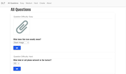
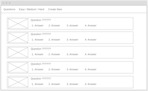

# Digital Lit Testing v2.0
I'll be the first to say that this project is not my best work. It went really well at first, but I ran into a lot of issues with implementing auth using JWT tokens and getting React to behave the way I wanted to. Due to time constraints, I had to roll back my firebase backend functions to where they had no authentication, then I could finally proceed with using axios and getting react to render stuff. I also used MDBootstrap for their frontend components which saved me a bit of time writing some CSS.

## [practicetesting.netlify.app](https://practicetesting.netlify.app/)  
### [Backend Repo (Hosted on Firebase)](https://github.com/richclarke0/CapstoneDigitalLitBackend)
| Screenshot   |  Wireframe  | 
|---------------|-------------|
|  |   |

## Technologies
- Firebase
- React
- Axios
- MDBootstrap
- Node
- Express
- ~~react-foundation~~ (dropped because it just wasn't that great)
- ~~axios-hooks~~ (didn't work the way I wanted it to)Firebase

## Model:
*None*

## Future Enhancements:
- User Authorization
- Scoring
- Administration
- Generating random test with different difficulties
- Storing test scores and test formats
